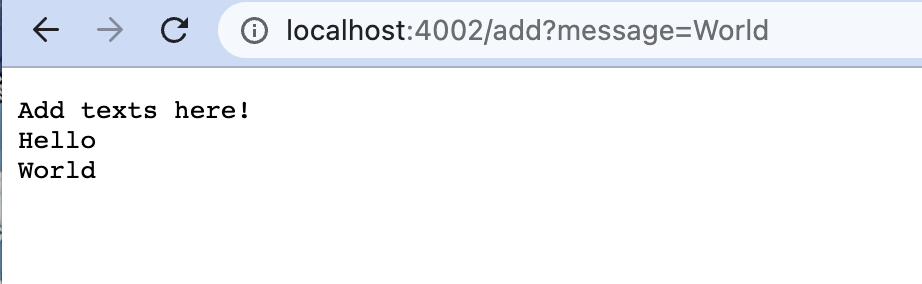

Part 1:
Here is the code for my StringServer:

This is the first method I called in the webServer:

In order to display the texts in the web server, I called the method handleRequest with the parameter url which is a URI object. 
According to the handleRequest method, it first looked at the line I typed in, which is the /add?message=Hello. 
It checked if the line contains the characters "add", and since the line did contain those characters, the method split the line from the 
equal sign and take the first element after it. In this case, it took the string Hello and return it. 
The String Hello was also updated to the String str.
Then it added a new line after printing the text on the web server.

Then I called the /add?message=World.

It again called the method handleRequest in the Handler class. 
Since it also contained the keyword add, it spilted the line and took the first character after the equal sign which is the String characters World.
Then the String character would be added to the String str, and printed out along with the previous Strings in the str but in a new line. 

