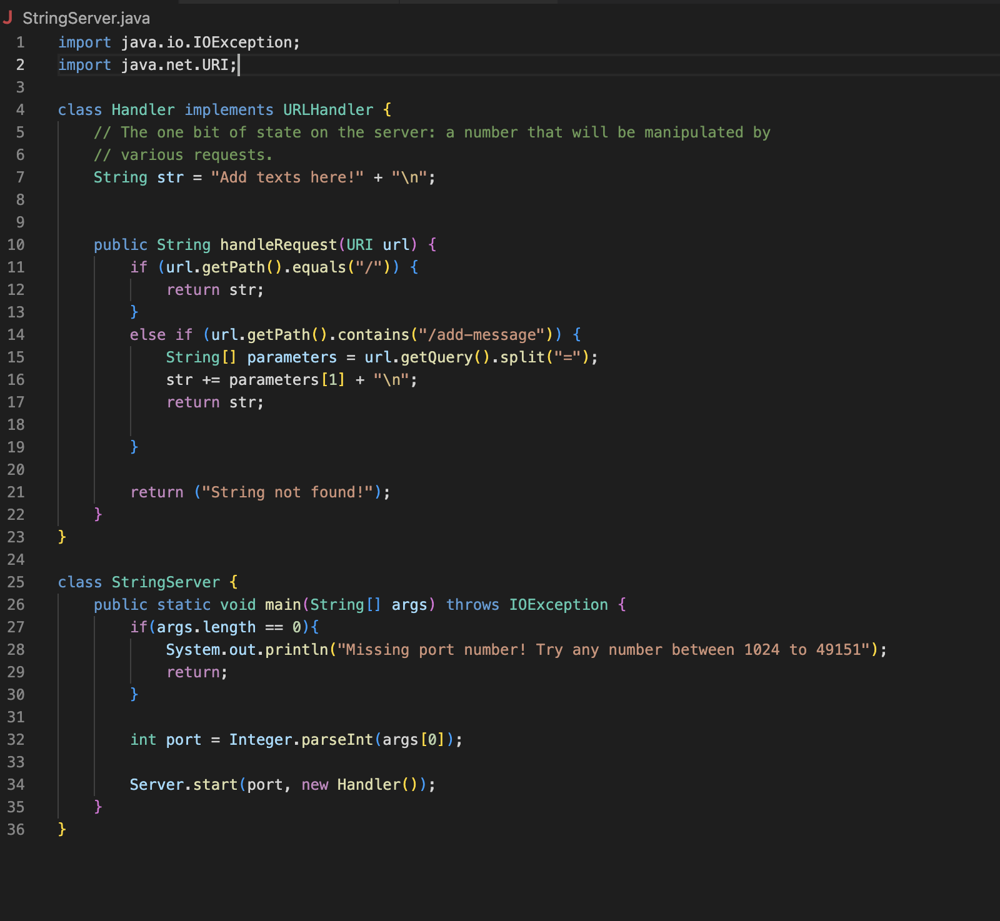
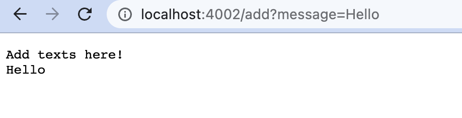
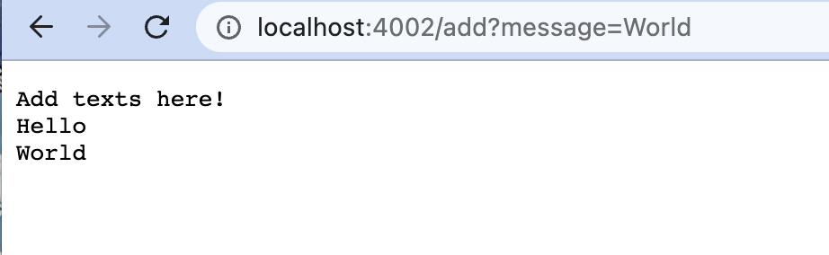
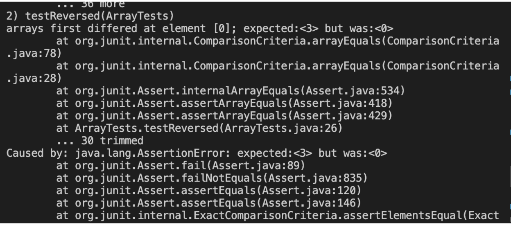
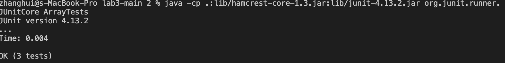

## Part 1:
Here is the code for my StringServer:
 

This is the first method I called in the webServer:


In order to display the texts in the web server, I called the method ```handleRequest``` with the parameter ```url``` which is a URI object. 
According to the ```handleRequest``` method, it first used ```getPath()``` method to obtain the path of the url ad looked at the path I typed in, which is the ```/add?message=Hello```. 
It checked if the line contains the characters ```add```, and since the line did contain those characters, the method returns the query of the url using ```getQuery()```, split the line from the equal sign, and take the first String after it. In this case, it took the string ```Hello``` and return it. 
The String ```Hello``` was also updated to the String ```str```.
Then it added a new line after printing the text to the web server.

Then I called the ```/add?message=World```.


It again called the method ```handleRequest``` in the Handler class. 
Since it also contained the keyword ```add```, it spilted the line and took the first character after the equal sign which is the String character ```World```.
Then the String character would be added to the String ```str```, and printed out along with the previous Strings in the str but in a new line. 

## Part 2
  
The code below is a failure-inducing input for the buggy program.
```
# code block
@Test
  public void testReversed() {
    int[] input2 = {1, 2, 3};
    ArrayExamples.reversed(input2);
    assertArrayEquals(new int[]{ 3, 2, 1 }, input2);
  }
```
 
The expected output should be ```{3, 2, 1}``` when the input is ```# {1, 2, 3}```, while the actual output is ```# {0, 0, 0}```, as shown in the screenshot below.


An input that does not induce a failure:
```
# code block
@Test
  public void testReversed() {
    int[] input1 = { };
    assertArrayEquals(new int[]{ }, ArrayExamples.reversed(input1));
  }
```

Since the input ```input1``` is empty, the expected output is also an empty list. Therefore, despite the buggy program, it would also produce an empty list that matches the expected output. 


The following code is the original method ```reversed``` in the ArrayExamples class.
```
# code block
static int[] reversed(int[] arr) {
    int[] newArray = new int[arr.length];
    for(int i = 0; i < arr.length; i += 1) {
      arr[i] = newArray[arr.length - i - 1];
    }
}
```

The following is the code after correction:
```
# code block
static int[] reversed(int[] arr) {
    int[] newArray = new int[arr.length];
    for(int i = 0; i < arr.length; i++) {
      newArray[i] = arr[i];
    }
    for(int i = 0; i < arr.length; i += 1) {
      arr[i] = newArray[arr.length - i - 1];
    }
    return arr;
}
```

The original code could not work appropriately is because it does not assign the same elements stored in the list ```arr ```into the new defined array ```newArray```. Without assigning, the new array has the same length as ```arr``` but all the elements in there are 0. Therefore, when it assign the elements in ```arr``` with the current element in ```newArray```, all of the elements would become 0. For correction, I copied all of the values in ```arr``` into the ```newArray```, so we can use these values to re-assign elements in ```arr``` in the reversed order. 

## Part 3

The first thing that I learned is how to write a web server in week 2. Before this course, I only learned how to write java code in platforms such as visual code and execute in the terminal. I have never thought about using java language to construct a web server that can have so many useful functions. Also, I was really surprised that we can actually control computers from remote. In week 3, I learned the differences between sympton and bugs of programs, and I also learned ways to test codes and correct bugs. 
